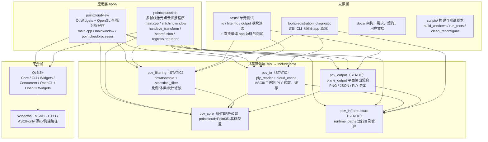

# 代码构成与架构图

本文档基于对仓库源码、CMake 目标与依赖关系的实际扫描生成，描述
PointCloudSuite 的代码构成，并给出清晰的架构图。

## 架构图（Mermaid）

## 分层依赖关系

| 目标 | 类型 | 内容 | 依赖 |
| --- | --- | --- | --- |
| `pcv_core` | INTERFACE 库 | `point_types.h`：`pointcloud::Point3D` | Qt::Core |
| `pcv_infrastructure` | 静态库 | `runtime_paths`：应用数据/缓存/日志/导出目录 | Qt::Core |
| `pcv_io` | 静态库 | `ply_reader`（ASCII/二进制 LE/BE，进度、取消、并行解析）、`cloud_cache`（校验缓存） | pcv_core、pcv_infrastructure、Qt::Core |
| `pcv_filtering` | 静态库 | `downsample`（比例/体素，首点与质心策略）、`statistical_filter` | pcv_core、Qt::Core |
| `pcv_output` | 静态库 | `plane_output`：作业上下文校验、平面 PNG/JSON/PLY 契约导出、错误码 | pcv_infrastructure、pcv_core、Qt::Core、Qt::Gui |
| `pointcloudview` | 可执行程序 | PLY 加载/缓存、降噪、三点平面提取、工件坐标系、障碍检测、平面边缘分割、平面图像导出 | 全部 pcv 库 + Qt Widgets/Concurrent/OpenGL/OpenGLWidgets |
| `pointcloudstitch` | 可执行程序 | 手眼标定读取、逐帧机器人坐标转换、相邻帧 ICP 配准（平面预对齐/结构验收/信赖域）、接缝融合、回归模式 | 全部 pcv 库 + Qt Core/Gui/Widgets/Concurrent |
| `registration_diagnostic` | CLI（默认关闭） | 直接编译 `apps/pointcloudview/pointcloudprocessor.cpp` | pcv_core、pcv_infrastructure、pcv_io、pcv_filtering |
| 单元测试（5 个共享模块/适配测试 + 2 个 app 源码测试） | CTest | `tests/unit/{io,filtering,output,pointcloudview,registration}` | 对应 pcv 库；app 测试直接编译 `apps/` 内源文件 |

## 代码规模（按目录）

| 目录 | 说明 | 约行数 |
| --- | --- | --- |
| `apps/pointcloudview` | 查看/分析程序（`pointcloudprocessor.cpp` 约 210 KB、`mainwindow.cpp` 约 140 KB） | ~7,900 |
| `apps/pointcloudstitch` | 拼接程序（配准/手眼/接缝/回归） | ~3,600 |
| `src/io` + `include/pcv/io` | PLY 读取与缓存 | ~980 |
| `src/filtering` + `include/pcv/filtering` | 降采样与统计滤波 | ~410 |
| `src/output` + `include/pcv/output` | 平面输出契约 | ~370 |
| `src/infrastructure` + `include/pcv/infrastructure` | 运行目录 | ~45 |
| `src/core` + `include/pcv/core` | 基础类型 | ~15 |

## 依赖规则（与 docs/architecture/overview.md 一致）

1. 共享算法代码不得依赖 Qt Widgets。
2. 应用可依赖共享模块；共享模块不得反向依赖应用。
3. 运行时生成文件不得写入源码树。
4. 测试只在根 `tests/` 目录注册。

## 当前维护提示

- 两个应用各维护一份同名但内容不同的 `pointcloudprocessor.{h,cpp}`
  （`pointcloudview` 版约 7,600 行，`pointcloudstitch` 版约 1,700 行），
  文档说明这是“算法逐步抽取期间保持的应用边界”；`tests/` 与
  `tools/registration_diagnostic` 均以“直接编译 app 源文件”方式复用，
  而非链接共享库。
- `mid_gap/parallel_ascii_tests/` 与 `test_pointcloud_a/` 属于实验/回归产物目录，
  不属于源码发布集；`.gitignore` 对两者均提供目录级排除规则。
